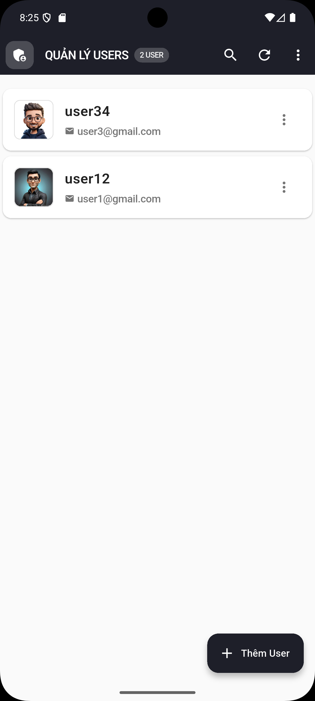

# 🎯 Admin Panel - Flutter Application

[](https://flutter.dev/)
[](https://firebase.google.com/)
[](https://pub.dev/packages/get)

Ứng dụng quản lý người dùng (Admin Panel) được xây dựng bằng Flutter với Firebase và GetX State Management.

---

## ✨ Features

### 🔐 Authentication
- Login system với email/password
- Custom authentication với SHA256 hashing
- Session management với GetX

### 👥 User Management (CRUD)
- ✅ **Create** - Tạo user mới với đầy đủ thông tin
- ✅ **Read** - Xem danh sách users với realtime updates
- ✅ **Update** - Chỉnh sửa thông tin user và ảnh profile
- ✅ **Delete** - Xóa user và ảnh tương ứng

### 🖼️ Image Management
- Upload ảnh profile từ gallery hoặc camera
- Preview ảnh trước khi upload
- Tự động xóa ảnh cũ khi update
- Tên file unique với timestamp

### 🔍 Search & Filter
- Tìm kiếm user theo username
- Tìm kiếm user theo email
- Live search với reactive updates

### 🎨 Modern UI/UX
- Giao diện hiện đại với tone trắng đen
- Material Design 3
- Smooth animations và transitions
- Responsive layout
- Pull to refresh

---

## 🛠️ Tech Stack

| Category | Technology |
|----------|-----------|
| **Framework** | Flutter (>=3.9.2) |
| **Database** | Firebase Firestore |
| **Storage** | Firebase Storage |
| **Authentication** | Custom (SHA256 Hashing) |
| **State Management** | GetX |
| **Architecture** | MVC Pattern |
| **Navigation** | GetX Navigation |
| **Image Picker** | image_picker |
| **Image Caching** | cached_network_image |

---

## 📋 Prerequisites

Trước khi chạy project, đảm bảo bạn đã cài đặt:

- [Flutter SDK](https://flutter.dev/docs/get-started/install) (>=3.9.2)
- [Android Studio](https://developer.android.com/studio) hoặc [VS Code](https://code.visualstudio.com/)
- [Firebase Project](https://console.firebase.google.com/) (Firestore + Storage đã enable)
- Android Device/Emulator hoặc iOS Simulator

---

## 🚀 Getting Started

### 1. Clone Repository

```bash
git clone https://github.com/YOUR_USERNAME/admin-panel.git
cd admin-panel
```

### 2. Install Dependencies

```bash
flutter pub get
```

### 3. Firebase Setup

#### a. Enable Firestore Database
1. Vào [Firebase Console](https://console.firebase.google.com/)
2. Chọn project của bạn
3. Vào **Firestore Database** → **Create database**
4. Chọn **Start in test mode** (cho development)
5. Chọn location và **Enable**

#### b. Enable Firebase Storage
1. Vào **Storage** → **Get Started**
2. Chọn location → **Done**
3. Vào tab **Rules** và cập nhật rules:

```javascript
rules_version = '2';
service firebase.storage {
  match /b/{bucket}/o {
    match /{allPaths=**} {
      allow read, write: if request.time < timestamp.date(2025, 12, 31);
    }
  }
}
```

#### c. Download Config File
1. Vào **Project Settings** → **Your apps**
2. Click **Add app** → Chọn **Android**
3. Nhập **Package name**: `com.example.admin_panel`
4. Download `google-services.json`
5. Copy file vào `android/app/google-services.json`

### 4. Configure Firestore Security Rules

Vào **Firestore Database** → **Rules** và paste:

```javascript
rules_version = '2';
service cloud.firestore {
  match /databases/{database}/documents {
    match /{document=**} {
      allow read, write: if request.time < timestamp.date(2025, 12, 31);
    }
  }
}
```

Click **Publish**.

### 5. Run Application

```bash
flutter run
```

---

## 🔑 Login Credentials

**Admin Account (Hardcoded):**

```
📧 Email:    admin@gmail.com
🔐 Password: admin123
```

**Lưu ý:**
- Tài khoản admin được hardcoded trong code (không lưu trong database)
- Chỉ dùng để login và quản lý users trong Firestore
- Users trong Firestore là dữ liệu riêng, không liên quan đến authentication

---

## 📁 Project Structure

```
lib/
├── controllers/          # GetX Controllers (Business Logic)
│   ├── auth_controller.dart      # Authentication state
│   └── user_controller.dart      # User CRUD operations
│
├── models/              # Data Models
│   └── user_model.dart           # User data model
│
├── services/            # Data Layer
│   ├── auth_service.dart         # Authentication service
│   ├── firestore_service.dart    # Firestore CRUD operations
│   └── storage_service.dart      # Firebase Storage operations
│
├── screens/             # UI Screens (Views)
│   ├── login_screen.dart
│   ├── user_list_screen.dart
│   ├── user_form_screen.dart
│   └── user_detail_screen.dart
│
├── widgets/             # Reusable UI Components
│   ├── custom_button.dart
│   ├── custom_textfield.dart
│   ├── image_picker_widget.dart
│   ├── user_card.dart
│   └── confirm_dialog.dart
│
├── utils/               # Utilities
│   ├── constants.dart            # App constants, theme
│   ├── validators.dart           # Form validation
│   └── app_icons.dart            # Icon constants
│
├── routes/              # Routing (Optional)
│   ├── app_routes.dart
│   └── app_middleware.dart
│
└── main.dart            # App Entry Point
```

---

## 🗄️ Database Schema

### Firestore Collection: `users`

| Field | Type | Description | Required |
|-------|------|-------------|----------|
| `username` | String | Tên người dùng | ✅ Yes |
| `email` | String | Email (unique) | ✅ Yes |
| `password` | String | Password đã hash (SHA256) | ✅ Yes |
| `imageUrl` | String? | URL ảnh profile từ Firebase Storage | ❌ Optional |

**Example Document:**
```json
{
  "username": "john_doe",
  "email": "john@example.com",
  "password": "5e884898da28047151d0e56f8dc6292773603d0d6aabbdd62a11ef721d1542d8",
  "imageUrl": "https://firebasestorage.googleapis.com/..."
}
```

---

## 🎯 GetX Features

### Reactive State Management
- **Obx()** - Automatic UI updates khi state thay đổi
- **RxList** - Reactive lists
- **RxBool, RxString** - Reactive primitives

### Dependency Injection
- **Get.put()** - Singleton instances
- **Get.lazyPut()** - Lazy initialization
- **Get.find()** - Retrieve dependencies

### Navigation
- **Get.to()** - Navigate to new screen
- **Get.back()** - Go back
- **Get.off()** - Replace current screen
- **Get.until()** - Navigate until condition

### Utilities
- **Get.snackbar()** - Show snackbar messages
- **Get.dialog()** - Show dialogs
- **No Context Required** - Navigate without BuildContext

---

## 📖 Documentation

- 📘 [Setup Instructions](./HUONG_DAN_SETUP.md) - Hướng dẫn setup chi tiết
- 🔗 [Firebase Connection](./HUONG_DAN_KET_NOI_FIREBASE.md) - Kết nối Firebase


---


## 📸 Screenshots



---


## 👤 Author

**Your Name**
- GitHub: [@truongcongtu318](https://github.com/yourusername)
- Email:tct31082004@gmail.com

---

## 🙏 Acknowledgments

- [Flutter](https://flutter.dev/) - Beautiful UI toolkit
- [Firebase](https://firebase.google.com/) - Backend infrastructure
- [GetX](https://pub.dev/packages/get) - State management solution
- [Material Design](https://material.io/) - Design system

---

## ⚠️ Important Notes

- 🔒 **Security:** Firestore và Storage Rules hiện đang ở test mode (cho phép tất cả). Khi deploy production, cần cập nhật rules bảo mật hơn.
- 🎓 **Academic Project:** Đây là project đồ án môn học, không nên sử dụng cho production.
- 🔑 **Admin Credentials:** Tài khoản admin được hardcoded trong code, chỉ dùng cho mục đích demo.

---

**⭐ Nếu project này hữu ích, hãy cho một star!**
